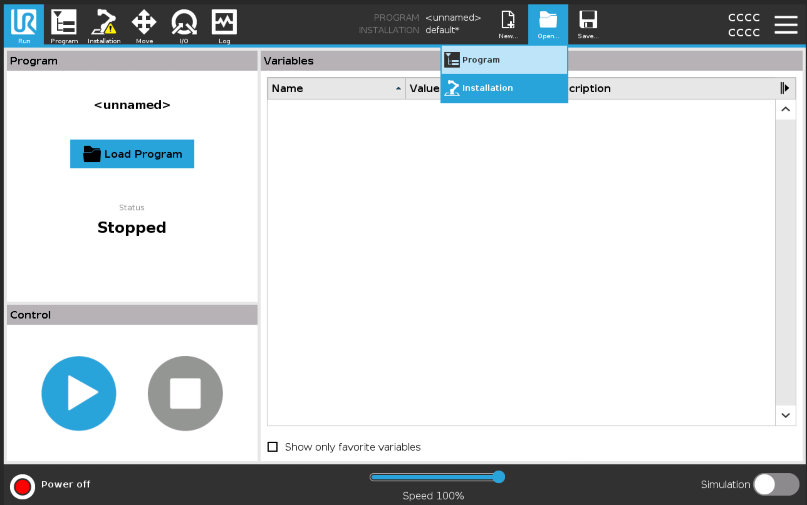
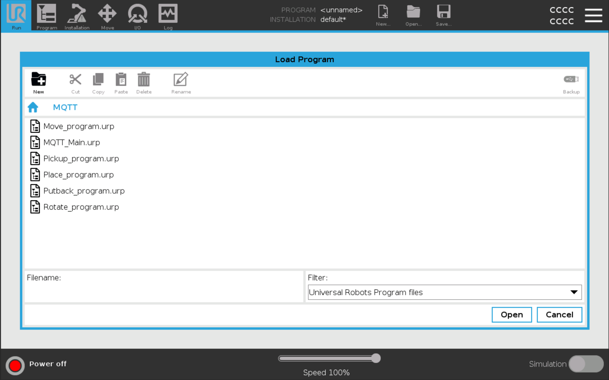
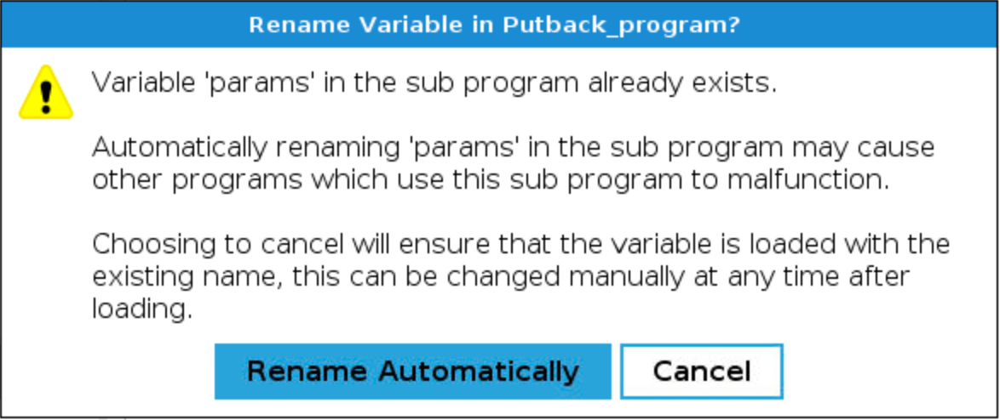
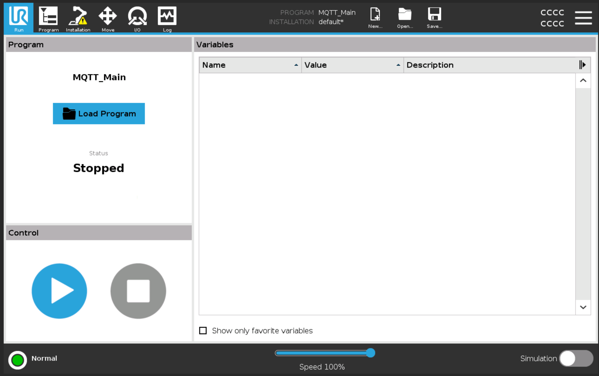
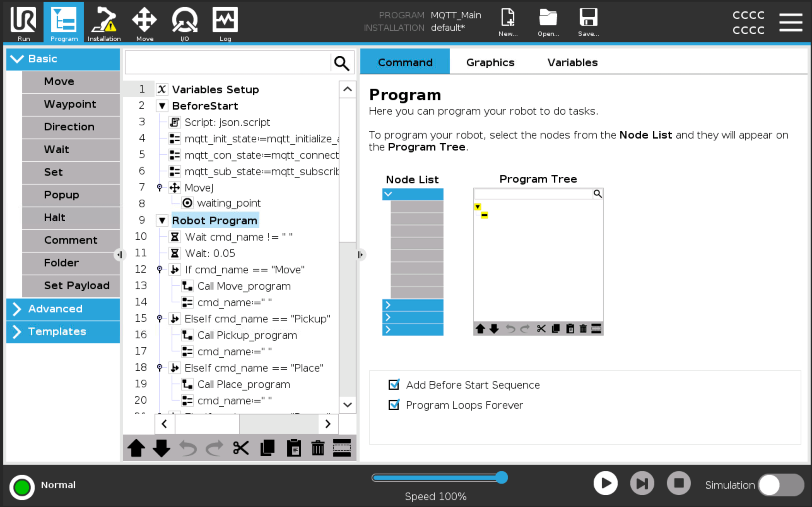
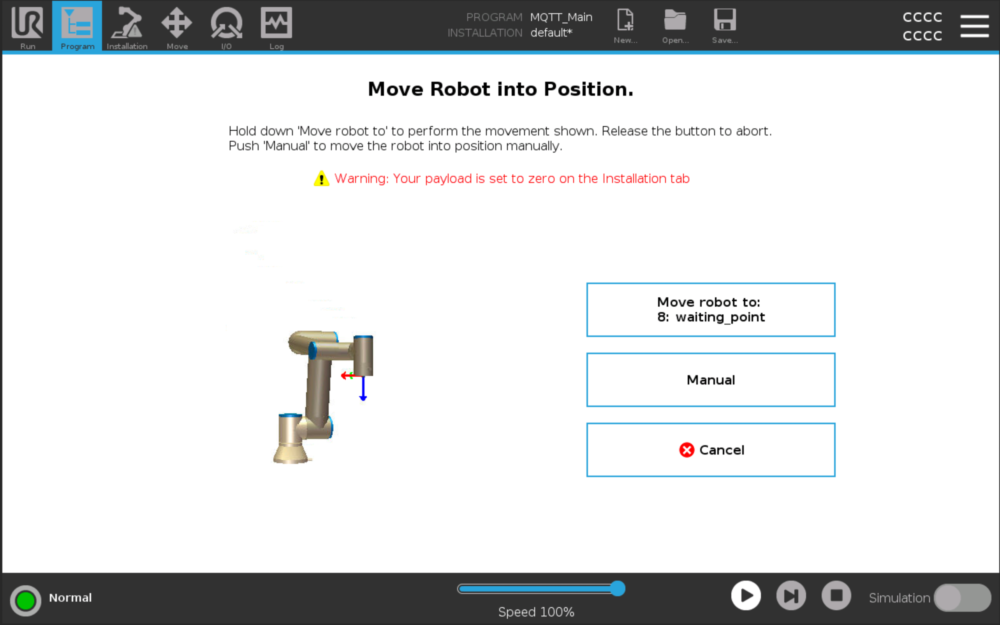
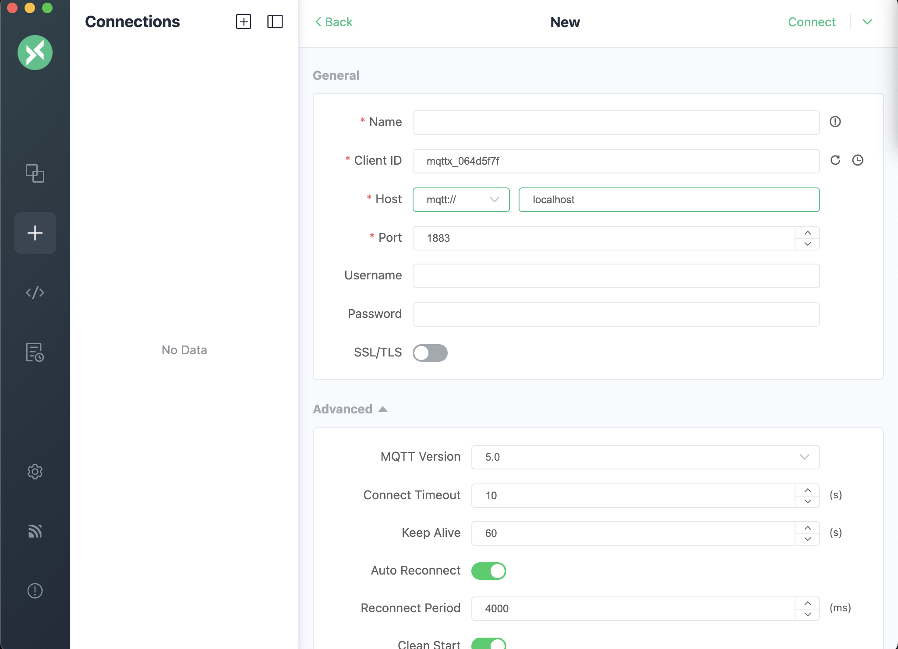
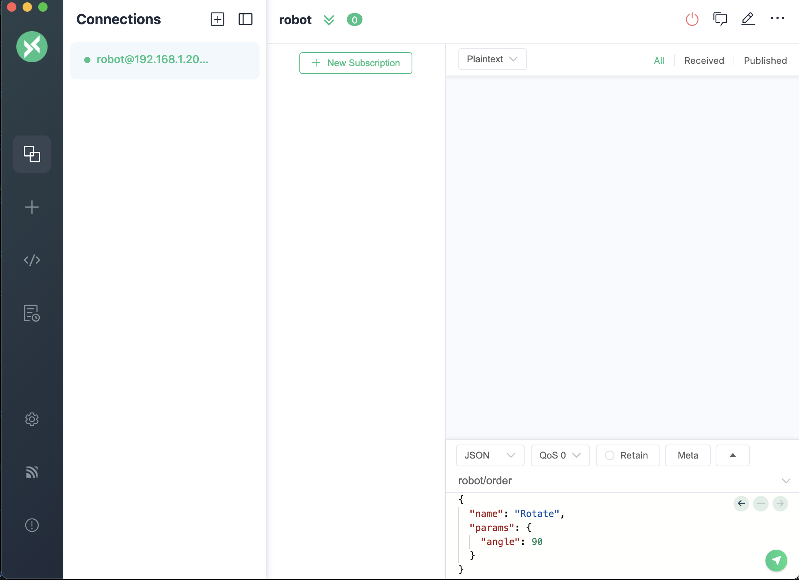

# UR10E controller over MQTT
This repository allow the robot UR10e to be controlled by MQTT commands with this plugin:  https://www.universal-robots.com/fi/plus/products/4each/mqtt-connector-professional/.

**You can use this project with a real UR bot or with the UR simulator:** 
* To install it on real robot follow this tuto: [here](#mqtt-broker-on-a-computerserver).  
* Otherwise to use the simulator follow this tuto: [here](#simulation)

# MQTT Broker on a Computer/Server
## Requirements
Install mosquitto broker: https://mosquitto.org/download/  

All setup files are in Mosquitto directory of this repository.

Set up your ip adress to be on the network: 192.168.4.0/24 and the ip adress of the broker must be 192.168.4.1 (basicely your PC).

## Start broker
You can start it with:

```
mosquitto -c path/of/mosquitto_robot.conf
```

You may have probleme with mosquitto_pswd.conf file. To resolve this start mosquitto in the current directory or change the line:
```
password_file path/of/file/mosquitto_pswd.conf
``` 

# JSON Payload

## Order of the robot
**You need to sent the order to the topic robot/order**. below is an example of a Json order. You can see all the order in directory json_scenario (example and schema).
```json
{
  "name": "Move",
  "params": {
    "direction": "left",
    "distance_cm": 10
  }
}
```


# Simulation
You can also use our project with a simulation bring on the URsim. On the simulation, you will access on a MQTT Broker directly intragted on the simulation. 

## Installation

### Install Git
Install git to have the update and clone the repository on your computer/server.

**Download [here](https://git-scm.com/downloads) or follow the different command line.**

On linux:
```bash
sudo apt-get install git
```

On mac:

```bash
brew install git
```

### Install Docker
The simulation works with a docker compose file. You need to install docker on your computer or server. 
https://docs.docker.com/engine/install/ (see documentation).

On linux:
```bash
sudo apt-get install docker-ce docker-ce-cli containerd.io docker-buildx-plugin docker-compose-plugin
```

On mac:

```bash
brew install docker
```

### Install MQTTX
**Download [here](https://mqttx.app/downloads) or follow the different command line.**

On linux:
```bash
sudo apt-get install mqttx
```

On mac:

```bash
brew install mqttx
```

### Clone Repository
Clone the repository on diretory you want.
```bash
git clone https://github.com/kiki442002/UR10E.git
```

### Run

Open the directory where the git repository was clone on your terminal:
```bash
cd UR10E
```

Run the docker compose with this command:
```bash
docker-compose up
```

#### Interface Access
##### URL
Open the url http://localhost:6080/vnc_auto.html, if the container is on the same laptop. Otherwise change localhost by the ip adress of the server. 
You will access at the interface of URsim after you will click on connect.

##### VNC Application
You can also download a VNC application like [TigerVNC](https://tigervnc.org/) to connect to the interface of the robot. This solution is more sustainable. Open the application and write: change_with_ip_server_adress:5900 to connect to it (basicly localhost:5900 if you are on the same machine). 


### Fisrt Utilisation

##### Start the robot

When you will acces to the interface you will see that. Fisrt at all you need to activate the robot before every usage. For that click on "power off" on the left bottom side. <br><br>


Click on "on" two times. Every circles have to be green and then click on "exit".


##### MQTT Plugin Installation
You must install the plugin only once. After that, you don't need to redo again, unless the container was clean.


Open the robot settings. <br><br>


On the settings menu, go to System -> URCaps and click on the left bottom plus symbol. <br><br>


Select mqtt-connectors and click on open. <br><br>


Click on the restart button <br><br><br><br>


You can verify if the mqtt connector is installed in going into the installation window. On URCaps menu you must see MQTT Connector tab. 

##### Lauch the program

Open this windows by clicking on open->program<br><br>


Open the directory MQTT and select MQTT_main.urp and click on open. The program will be now loaded.<br><br>


For each windows like that select **cancel**<br><br>



Run the program by clicking on the play logo.<br><br>


Stay push on the button **Move robot to:** and run the program. We can access of the visual of the robot by clicking on **Graphics** tab or on the **Move** menu after.<br><br>

**We have now done all the steps to lauch the program on the robot.**


#### MQTT connection with simulation and MQTTX
To connect to the MQTT broker you can use the **ip address of the server with the port 1883**, so on the same machine 'localhost:1883'. 
In URSim, you need to indicate the name of the mosquitto broker container so just replace the ip address by 'mosquito' with the port 1883 again.

Open MQTTX and add a new server MQTT with this settings below:

Replace your ip address by the ip address of your server and click on connect.<br><br>


You can now send a command on the text area in the back left side. Fill the topic with **robot/order** and select a JSON payload. To send your message click on the green button.<br>

**You can now control the robot with MQTTX**


### Stop
If you want to stop doker containers just press ctrl+c on the terminal that you have lauch it before.
Otherwise you can desintall all non persitant volume with the command:

```bash
docker-compose down
```