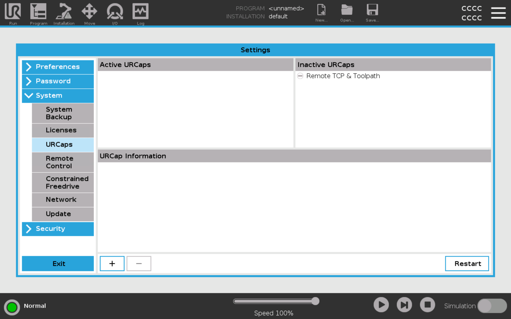

# UR10E controller over MQTT
This repository allow the robot UR10e to be controlled by MQTT commands with this plugin:  https://www.universal-robots.com/fi/plus/products/4each/mqtt-connector-professional/.

# MQTT Broker on a Computer/Server
## Requirements
Install mosquitto broker: https://mosquitto.org/download/  

All setup files are in Mosquitto directory of this repository.

Set up your ip adress to be on the network: 192.168.4.0/24 and the ip adress of the broker must be 192.168.4.1 (basicely your PC).

## Start broker
You can start it with:

```
mosquitto -c path/of/mosquitto_robot.conf
```

You may have probleme with mosquitto_pswd.conf file. To resolve this start mosquitto in the current directory or change the line:
```
password_file path/of/file/mosquitto_pswd.conf
``` 

# JSON Payload

## Order of the robot
**You need to sent the order to the topic robot/order**
```json
{
     
    "order": "integer", 
    "new_pos": ["float", "float", "float", "float", "float", "float"],
    "target_point": "integer",
    "freedrive": "integer",
    "systeme_msg": "String"
}
```
Field description:


order: Defines the robot action type: give an object to preset zone at the user (1), take an object to user at the preset zone (2), make a relative movement (3), set the robot in freedrive (4), stop the robot in emergency (5), go robot at home position (6) or (-1) if there is an error in the request.
new_pos: Robot position in meters. x: Positive = Right, Negative = Left y: Positive = Front, Negative = Back z: Positive = Down, Negative = Up / rx, ry, rz: Robot rotation in degrees (specify rotation axes). By default, relative movement values are in centimeters.
target_point: Zone where the robot moves in absolute movement. The zones can be named tools (-1) if there is a problem with an absolute movement command.
freedrive: Take an object to user at the preset zone in freedrive mode (1).
systeme_msg: Description of problems encountered when interpreting the command (leave blank if no error).

## Status of the robot
**You need to subscribe to this topic robot/status**

```json
{
    "status": "string" //OK, turn_on, turn_off
}
```

# Simulation
You can also use our project with a simulation bring on the URsim. On the simulation, you will access on a MQTT Broker directly intragted on the simulation. 

## Installation

### Install Docker
The simulation works with a docker compose file. You need to install docker on your computer or server. 
https://docs.docker.com/engine/install/ (see documentation).

On linux:
```bash
sudo apt-get install docker-ce docker-ce-cli containerd.io docker-buildx-plugin docker-compose-plugin
```

On mac:

```bash
brew install docker
```

### Clone Repository
```bash
git clone https://github.com/kiki442002/UR10E.git
```

### Run
```bash
cd UR10E
docker-compose up
```

### Fisrt Utilisation
#### Interface Access
##### URL
Open the url http://localhost:6080/vnc_auto.html, if the container is on the same laptop. Otherwise change localhost by the ip adress of the server. 
You will access at the interface of URsim after you will click on connect.

##### VNC Application
You can also download a VNC application like [TigerVNC](https://tigervnc.org/) to connect to the interface of the robot. This solution is more sustainable. Open the application and write: ip_server_adress:5900 to connect to it. 

#### URSIM

##### Start the robot

When you will acces to the interface you will see that. Fisrt at all you need to activate the robot before every usage. For that click on "power off" on the left bottom side. <br><br>


Click on "on" two times. Every circles have to be green and then click on "exit".


##### MQTT Plugin Installation
You must install the plugin only once. After that, you don't need to redo again, unless the container was clean.


Open the robot settings. <br><br>


On the settings menu, go to System -> URCaps and click on the left bottom plus symbol. <br><br>


Select mqtt-connectors and click on open. <br><br>


Click on the restart button <br><br><br><br>


You can verify if the mqtt connector is installed in going into the installation window. On URCaps menu you must see MQTT Connector tab. 
